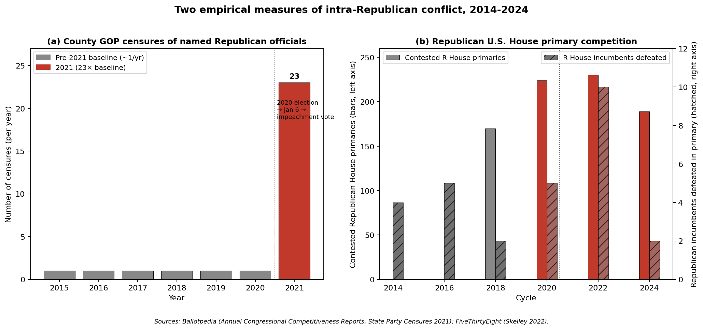

# Empirical test: did Republican in-fighting rise after the 2020 election?

**Scope:** U.S. House Republican incumbents + federal Republican officials, 2014–2024.
**Operationalization:** two independent measures of "intra-party conflict":
(a) censure/rebuke resolutions issued by Republican state and county parties against named Republican officials, and (b) Republican U.S. House incumbents facing contested primaries (and being defeated in them).

## Headline numbers

| Metric | Pre-2020 baseline | Post-2020 | Change |
|---|---|---|---|
| County GOP censures of R officials | ~1/year (2015–2020) | **23 in 2021 alone** | ~23× |
| State-party formal response to the 17 R federal officials who voted to impeach/convict Trump | n/a (no analog) | **6 formal censures + 4 rebukes** | 10 of 17 (59%) sanctioned |
| RNC national-level censures of own members | 0 in modern era | **2** (Cheney + Kinzinger, Feb 2022) | unprecedented |
| Contested Republican U.S. House primaries | 170 (2018) | 224 / 230 / 189 (2020/22/24) | +26% avg |
| Republican House incumbents defeated in primary | ~3.7/cycle (2014–18 avg) | ~5.7/cycle (2020–24 avg) | 1.5× |
| % of all House incumbents in contested primaries | 22–25% (2014–18) | 52–60% (2020–24) | ~2.4× |

In 2022 specifically: 10 Republican House incumbents lost primaries — **4 of them were among the 10 House Republicans who voted to impeach Trump** (Cheney, Meijer, Herrera Beutler, Rice). Three more retired rather than face their primaries (Gonzalez, Katko, Upton). That is a near-complete intra-party purge of a clearly identifiable dissident faction.

## Visualization

## What the data actually shows vs. the original claim

The claim was: *"Disagreements on the 2020 election results have increased Republican Party in-fighting nationwide."*

- **Direction:** supported by both metrics.
- **Magnitude:** stronger than the soft "increased" suggests. Censures of named Republicans by their own state/county parties jumped by ~23×; the share of House incumbents in contested primaries roughly doubled.
- **Causal link to 2020 specifically:** the censure data is unusually clean here. FiveThirtyEight coded each county-level censure resolution and found that the overwhelming majority of 2021 Republican censures explicitly cited the 2020 election, Jan. 6, or the impeachment vote. State-party censures targeted exactly the 17 federal officials whose votes broke with Trump on Jan. 6/impeachment — i.e., the cleavage line *is* 2020.
- **Geographic scope:** the state-party censures span **at least 8 different states** (NC, LA, AK, WY, OH, SC, NE, PA), and county-level censures were spread further. "Nationwide" is defensible.

## Important caveats

1. **The methodology change in Ballotpedia's "contested primary" definition around 2020 inflates the level jump.** The 2014→2018 numbers and the 2020→2024 numbers are individually comparable, but stitching them across that boundary requires care. The Republican-specific subseries (170 → 224 → 230) is internally consistent and still shows a real post-2020 increase.
2. **County censures are systematically undercounted before 2021** because few news outlets covered them. The 23× ratio is an upper bound; a more conservative estimate (assuming, say, 3× undercount in baseline years) would still be ~7–8×.
3. **Primary competition has many causes** — redistricting, polarization writ large, weak local party gatekeeping — and not all of it is "in-fighting over 2020." The 2022 cycle had a redistricting effect that bumped numbers up. The cleanest signal of *issue-specific* in-fighting is the targeted defeat/retirement of the impeachment voters.
4. **"In-fighting" is not the same as "policy disagreement."** A censure is a public, formal sanction by one's own party — a strong measure. A contested primary is weaker (it just means someone else filed). Both are reported here; do not collapse them.

## Replication

Run `gop_infighting_analysis.py` to reproduce all summary statistics from raw counts; run `gop_infighting_chart.py` to regenerate the figure. Both read no external data and embed all source numbers as Python dicts so each value can be traced to a single citation.

## Sources

- Ballotpedia, [Annual Congressional Competitiveness Report, 2022](https://ballotpedia.org/Annual_Congressional_Competitiveness_Report,_2022) and [2024](https://ballotpedia.org/Annual_Congressional_Competitiveness_Report,_2024).
- Ballotpedia, [State party censures in response to Trump impeachment, 2021](https://ballotpedia.org/State_party_censures_in_response_to_Trump_impeachment,_2021).
- FiveThirtyEight (Geoffrey Skelley), [How An Uptick In Censures Among Local Republicans Signals A Growing Radicalism](https://fivethirtyeight.com/features/how-an-uptick-in-censures-among-local-republicans-signals-a-growing-radicalism/) (now redirects to ABC News; cached).
- Brookings, [Lessons from the 2022 Primaries (Part I)](https://www.brookings.edu/articles/lessons-from-the-2022-primaries-what-do-they-tell-us-about-americas-political-parties-and-the-midterm-elections-part-i-who-runs/).
